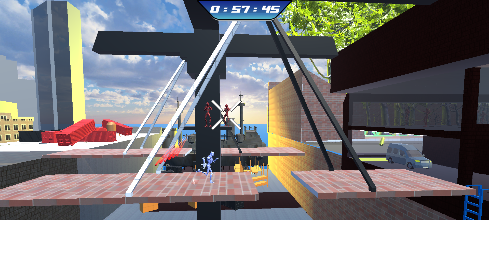

Urkead is a school project designing to learn Unity.
The project is a 2.5D platformer/shooter where the character autoruns.
The goal is to finish every level.

Date: 05/2019

___

## Authors

The project has been developed as a school assignment of [ISART Digital](https://www.isart.fr/) the project is then their and the authors property.
We do not proclaim property over any of the assets we use on the project except the [scripts](Assets/Scripts/)).

The project was done by Game designers and Game Programmers:

| Name | Role|
|:---:|:---:|
| AYRAL Malo | Game Designer
| CALBRIS Tristan | Game Designer
| LAUZIER Andre | Game Designer
| PETROVIC Dilane | Game Designer
| TRAORE Fatou Aicha | Game Designer
| PICHARD Amélie | Game Programmer
| DEPREZ Nicolas | Game Programmer
| BLEUSE Quentin | Game Programmer

___

## Showcase

Here are some in game screenshots:

___

## Techs

The project has been developed under Unity 2019.1.14f1

___

## Assets Ref

we used miyamo for animations.

___

## How to Build

Get Unity 2019.1.14f1 on the platform you want and build with it. Do mind, only controller inputs are supported.

Also a build is already available for windows user in the Build/ folder.

___

## How to Play

Here are the controls:

There is also a tutorial in the game so do not hesitate to use it.
___

## Known Bugs

- Array sort yield different results
- Animation bugs
- level 2 sometimes bugs (cannot go to next level/enemies cannot be defeated)
